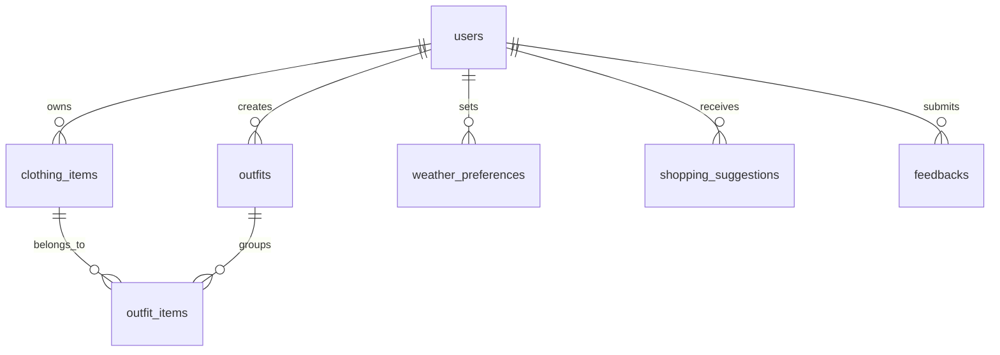
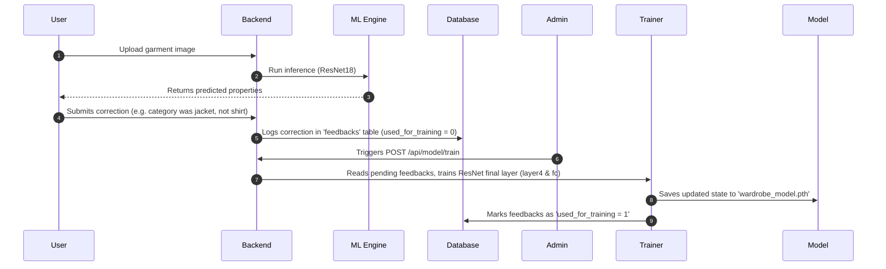

# WardrobeWizard 🪄👗

An AI-powered personal stylist application that helps you manage your wardrobe, scan clothing items using computer vision, generate outfits based on weather/style constraints, and track wear analytics.

---

## 🏗️ Architecture & System Design

WardrobeWizard is structured as a decoupled, multi-tier application with support for seamless local fallback and containerized deployments.

```mermaid
graph TD
    User([User Browser]) -->|HTTP / SPA| Frontend[Frontend: Nginx / Vanilla JS]
    User -->|API Requests| Backend[Backend: Flask API]
    
    subgraph Backend Services
        Backend --> OutfitGen[Outfit Generator]
        Backend --> WeatherSvc[Weather Service]
        Backend --> Analytics[Wardrobe Analytics]
        Backend --> DBService[DB Service Wrapper]
    end
    
    subgraph Data & ML Layer
        DBService -->|Write/Read| DB[(PostgreSQL / SQLite fallback)]
        Backend -->|Run Inference / Train| ML[ML: PyTorch ResNet18 Classifier]
        ML -->|Save Weights| ModelFile[wardrobe_model.pth]
    end

    subgraph External APIs
        WeatherSvc -->|Primary| OpenWeather[OpenWeather API]
        WeatherSvc -->|Fallback| OpenMeteo[Open-Meteo API (No Key)]
    end
```

---

## ✨ Core Features

*   **📷 AI Clothing Scanner** – Upload photos of clothing items. The system automatically:
    *   Classifies the item into one of 10 standard categories (T-shirt, Jeans, Dress, Jacket, Shoes, Hat, Scarf, Skirt, Shorts, Sweater) using a pre-trained **ResNet18** model.
    *   Extracts the top 3 dominant colors in HEX format using **K-Means clustering** (ensuring compatability with standard HTML color inputs).
    *   Detects if the clothing is *solid* or *patterned* using local patch variance analysis.
    *   Infers style suitability (casual vs. formal) based on categories.
*   **🧩 Smart Outfit Generator** – Recommends coordinated outfits containing Tops, Bottoms, Shoes, and optional Outerwear depending on occasion parameters and temperature thresholds. Includes fashion constraint checks:
    *   No clashing patterns (limits patterned items to one per outfit).
    *   Style consistency check (prevents mixing formal and athletic attire).
    *   Color harmony check (prevents same-color tops and bottoms).
*   **🎭 Aesthetic / Vibe Classifier & Filter** – Classifies clothing items and groups generated outfits dynamically into curated styling vibes:
    *   *Aesthetics Supported:* Clean Girl, Y2K, Quiet Luxury / Old Money, Coquette Core, Cottagecore, Neo Deco / Retro Glam, Dark Academia, Coastal Cowgirl, Gummy / Jelly Aesthetic, Indie Sleaze / Grunge Revival.
    *   *Automatic Segregation:* Groups multiple generated outfits by their matched aesthetics so users can toggle and select their preferred style flow.
    *   *Targeted Generation:* Filters inputs strictly so that the engine generates and suggests outfits conforming exclusively to a requested aesthetic.
*   **🌤️ Smart Weather Integration** – Detects local weather via geographic coordinates. Queries OpenWeather API, with a **zero-configuration fallback** to the public **Open-Meteo API** if no API key is specified. Auto-recommends layering strategies (e.g., adding jackets when the temperature falls below 15°C).
*   **📊 Wardrobe Analytics** – Visualizes wardrobe composition (categories, color distributions, unused garments, and most-worn items) and automatically flags wardrobe gaps (e.g., "Missing shoe variety", "Low on tops") to suggest shopping needs.
*   **🔄 Closed-Loop Machine Learning Feedback** – If the AI misclassifies a garment, the user can correct it. Corrections are logged in the database, and administrators can trigger on-demand model retraining `/api/model/train` which runs PyTorch fine-tuning on the custom dataset and updates the model weights locally.

---

## 🛠️ Technology Stack

| Layer | Technologies Used | Key Purpose |
| :--- | :--- | :--- |
| **Frontend** | HTML5, Vanilla JS, CSS3, Bootstrap 5, Chart.js | Responsive User Interface & interactive analytics dashboards |
| **Backend** | Python 3.9+, Flask, Flask-CORS, Gunicorn | REST API serving, routing, services logic, and static file serving |
| **Database** | PostgreSQL 13 (Docker/Prod), SQLite 3 (Dev fallback) | User profiles, wardrobe items, logged feedbacks, and outfit tables |
| **Machine Learning** | PyTorch, torchvision, scikit-learn, PIL, NumPy | Computer vision classification, clustering for colors, local variance analysis |
| **Infrastructure** | Docker, Nginx, OpenWeather API, Open-Meteo API | Container orchestration, caching, static hosting, and weather telemetry |

---

## 🗄️ Database Schema & Data Models

WardrobeWizard uses a highly versatile database service layer that runs on PostgreSQL in production but auto-provisions and runs an SQLite schema (`database/wardrobewizard.db`) if a PostgreSQL server is unavailable.

### Database Tables Visualized:



### Table Specifications:

1.  **`users`**: Manages profiles and security credentials.
    *   `id` (SERIAL PRIMARY KEY)
    *   `username` (VARCHAR, UNIQUE)
    *   `email` (VARCHAR, UNIQUE)
    *   `password_hash` (VARCHAR)
    *   `style_preferences` (JSONB)
    *   `created_at` (TIMESTAMP)
2.  **`clothing_items`**: Main catalog of user garments.
    *   `id` (SERIAL PRIMARY KEY)
    *   `user_id` (FOREIGN KEY -> users)
    *   `name` (VARCHAR)
    *   `category` (VARCHAR: `shirt`, `pants`, `shoes`, `jacket`, etc.)
    *   `subcategory` (VARCHAR)
    *   `color_primary` / `color_secondary` (VARCHAR HEX codes)
    *   `pattern` (VARCHAR: `solid`, `striped`, `patterned`)
    *   `style` (VARCHAR: `casual`, `formal`, `athletic`, `business`)
    *   `season` (VARCHAR ARRAY: `['summer', 'winter']`)
    *   `image_url` (TEXT)
    *   `times_worn` (INTEGER)
    *   `last_worn` (DATE)
3.  **`feedbacks`**: Captures user classifier corrections to build training sets.
    *   `id` (SERIAL PRIMARY KEY)
    *   `user_id` (FOREIGN KEY -> users)
    *   `image_path` (TEXT)
    *   `predicted_category` / `corrected_category` (VARCHAR)
    *   `predicted_color` / `corrected_color` (VARCHAR)
    *   `rating` (INTEGER)
    *   `used_for_training` (BOOLEAN DEFAULT FALSE)

---

## 🔌 API Endpoints Reference

### 🔐 Authentication
*   `POST /api/auth/register` - Register a new account.
*   `POST /api/auth/login` - Authenticate user credentials and create session cookie.
*   `POST /api/auth/logout` - Clear user session.
*   `GET /api/auth/me` - Fetch details for the logged-in session.

### 👗 Wardrobe Management
*   `GET /api/items` - Retrieve all clothing items belonging to the current user.
*   `POST /api/items` - Add a new garment manually.
*   `GET /api/analytics/wardrobe` - Gather distribution and gap analysis stats.

### 🧠 Machine Learning & Inference
*   `POST /api/analyze-clothing` - Upload an image to trigger model inference (returns category, dominant colors, pattern, and style).
*   `POST /api/feedback` - Log manual adjustments to AI prediction results.
*   `GET /api/feedback/stats` - Retrieve audit metrics (total feedback logs, pending training count).
*   `POST /api/model/train` - Admin route to trigger model fine-tuning on pending feedback items.

### 🌤️ Weather & Recommendations
*   `GET /api/weather?lat=<lat>&lon=<lon>` - Fetch current location-specific weather details.
*   `POST /api/outfits/generate` - Generate coordinated outfit combinations suited for specific occasion and weather attributes.

---

## 🚀 Quick Start (Docker Compose)

The easiest way to stand up the full environment, including the frontend Nginx web server, Flask backend API, and a preloaded PostgreSQL database, is via Docker.

### 1. Pre-requisites
*   [Docker Desktop](https://www.docker.com/products/docker-desktop/) installed.

### 2. Configure Environment Variables
Create a `.env` file in the project root:
```bash
cp .env.example .env
```
Open `.env` and configure:
```env
OPENWEATHER_API_KEY=your_openweathermap_api_key_here
SECRET_KEY=generate_a_random_secure_string_here
```

### 3. Spin Up Services
Run the following command to build images and launch containers:
```bash
docker-compose up -d --build
```

Once running, access the local system at:
*   **Frontend Client:** [http://localhost](http://localhost) (served via Nginx)
*   **Backend API Service:** [http://localhost:5000](http://localhost:5000)
*   **PostgreSQL Database Port:** `localhost:5432`

---

## 💻 Manual Setup & Local Development

To run the components individually without Docker, configure each layer manually:

### 1. Database Initialization
If you have PostgreSQL running locally:
```bash
psql -U postgres -c "CREATE DATABASE wardrobewizard;"
psql -U postgres -d wardrobewizard -f database/schema.sql
```
*Note: If PostgreSQL is not found or fails to connect, the application will automatically write and read from a local SQLite file in `database/wardrobewizard.db`.*

### 2. Python Backend & ML Engine Setup
Create a virtual environment, install requirements, and run the Flask developer server:
```bash
# Navigate to backend directory
cd backend

# Create and activate virtual environment
python -m venv venv
source venv/bin/activate  # On Windows use: venv\Scripts\activate

# Install dependencies (includes PyTorch, torchvision, scikit-learn)
pip install -r requirements.txt

# Start the Flask API server
python app.py
```
The Flask application will start on `http://localhost:5000`.

### 3. Frontend Web Client
Because the backend is configured to serve static files from `../frontend`, you can view the application directly at `http://localhost:5000` or host the static directory using your preferred local server:
```bash
cd frontend
python -m http.server 8000
```
Then navigate to `http://localhost:8000`.

---

## 🧠 Continuous ML Retraining Workflow



1.  When a feedback item is submitted, the image is saved to the local disk and a row is created in the database.
2.  Triggering `/api/model/train` initiates `ml/trainer.py`.
3.  The trainer maps the corrected clothing category to its standard ImageNet class index (e.g., `jeans` -> `608`).
4.  It loads `resnet18` with pre-trained weights, overlays any existing fine-tuned weights from `ml/wardrobe_model.pth`, and freezes the early feature-extraction layers.
5.  It unfreezes `layer4` (final convolutional block) and the `fc` (fully connected) classification head to adapt the weights specifically to the new corrections.
6.  The model trains for 5 epochs using an **Adam optimizer** with **Cross Entropy Loss**.
7.  The newly calculated weights are saved back to `ml/wardrobe_model.pth`. These are automatically loaded upon subsequent classification requests!
